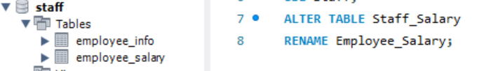
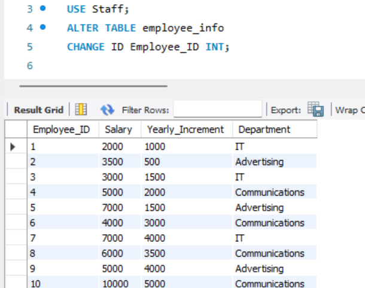
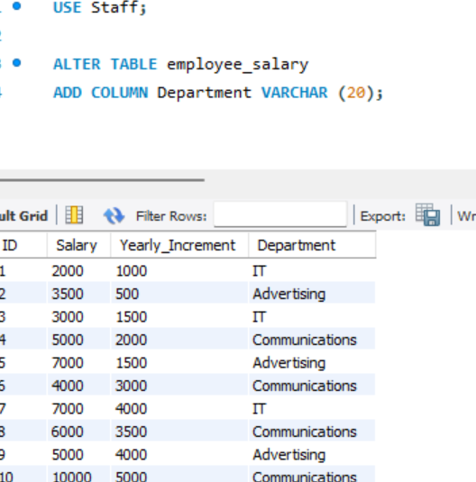
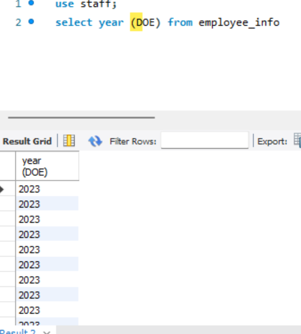
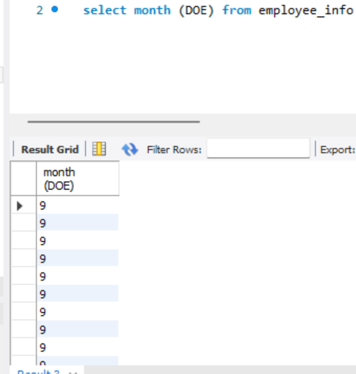
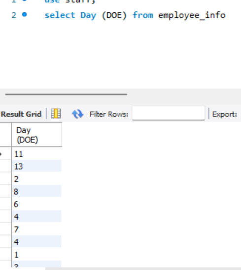
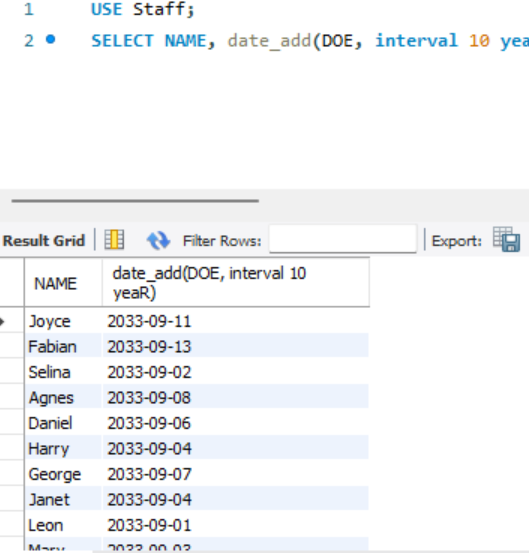

# Update/Modification of tables

### Introduction

One of the fundamental aspects of working with SQL databases, particularly in MySQL, is the ability to update and modify tables. This task is a guide to understanding the manipulation of data within MySQL tables, which entails utilizing SQL to effect changes to both the table structure and the data it contains.

### Problem statement:

1. Rename the tables to Employee_Info and Employee_Salary
2. Change the ID columns right  Employee_ID
3. Create a new column in the Employee_Salary named ‘Department’
4. For employee’s with the following IDs, update their department with the ones specified 
- 137 - IT
- 259 - Advertising
- 46810 - Communications

4. Change the data type of the IDs in both columns to Text data type 
5. Run a query that returns the month, year, and day each employee came into the company
6. Return a query that adds 10 years to the year the employees came into the company as their year_of_exit

 

The above snapshot demonstrates the effective renaming of the tables to 'Employee_Info' and 'Employee_Salary.' This was done through the use of the following syntax:

_Use 'database name',
Alter table Staff_info
“Rename  'Employee_Info.'"_

The above snapshot illustrates the modification made to the altered column and the syntax used is as follows; 
 
_USE 'database_name';
ALTER TABLE employee_info
CHANGE COLUMN ID employee_id datatype;_

This syntax is used to make a change to the column name in the table by specifying the data type.

The snapshot shown above indicates the addition of a new column to an existing table, and the syntax used is as follows:

_ALTER TABLE Employee_Info
ADD COLUMN Department VARCHAR(40);_

This command adds a new column named 'Department' with a VARCHAR data type to the 'Employee_Info' table.

The snapshot above shows the updated table using the employee's_ID and the syntax used is;

_UPDATE 'table_name'
SET Department =
    CASE
        WHEN employee_ID = 1 THEN 'IT'
        WHEN employee_ID = 3 THEN 'IT'
        WHEN employee_ID = 7 THEN 'IT'
        WHEN employee_ID = 2 THEN 'Advertising' ...
END;_

This command updates the 'Department' column based on the specified conditions for different 'employee_IDs' in the 'table_name.

Year                 |               Month           |               Day
:-------------------:|:-----------------------------:|:-----------------:
 |          |   

The snapshot shown above exhibits the query for presenting the year, month, and day distinctly, and the syntax used is as follows; 

_USE database_name;
SELECT YEAR(DOE) FROM employee_info;_

_USE Database_name
SELECT MONTH(DOE) FROM Employee_Info;_

_USE Database_Name
SELECT DAY(DOE) FROM Employee_Info;_

This query retrieves the year values from the "DOE" column in the specified database's "employee_info" table.

The provided snapshot showcases a query that adds ten years to the "DOE" (Date of Entry) in the "Employee_Info" table and the syntax is as follows;

USE Staff;
SELECT NAME, DATE_ADD(DOE, INTERVAL 10 YEAR) FROM Employee_Info;

This query selects the "NAME" and adds 10 years to the "DOE" (Date of Entry) in the "Employee_Info" table within the "Staff" database.

